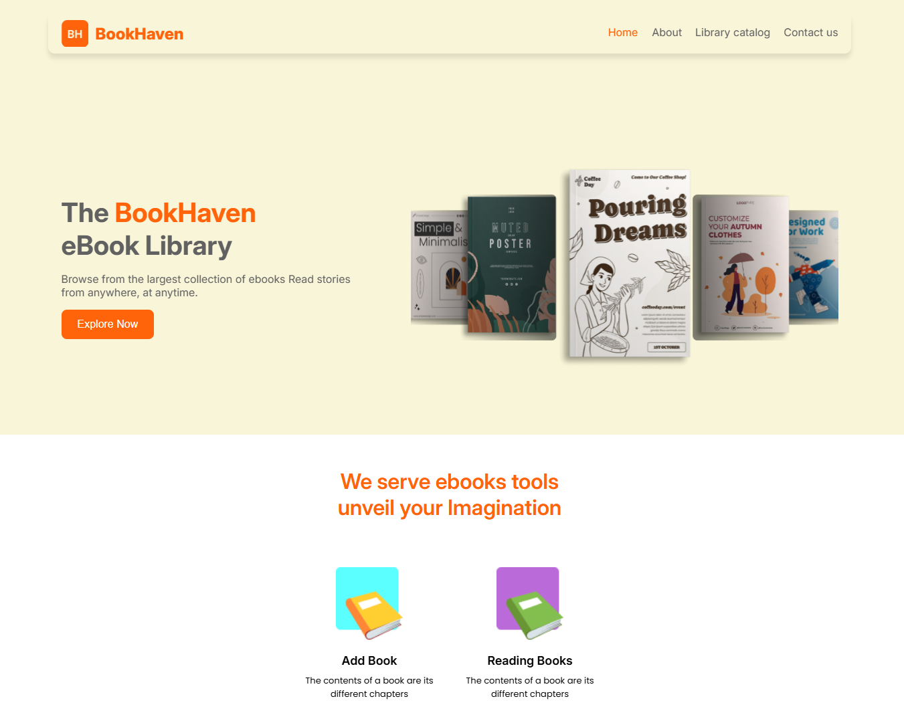

# Gaza Sky Geeks - Final project

## The project

- Project name: **Book Haven**
- Project description: A website to track your reading in the reading world! You can see books you read, unread, and switch the status of the book. Also, you can delete a book.
  Do you have a new book you want to read? Okay, no problem on the website you can add a new book too😁
If you have an issue you can send a message by email.

### Branches responsibility:

- Rahaf: master and rahaf
- Razan: razan
- Yazan: yazan

### Pages responsibility:

- Rahaf: Add book and contact us
- Razan: Read and unread books
- Yazan: Home

### The web page building by using:

- HTML5
- CSS
- Git
- Google fonts
- JS

### Libraries

- fontawesome
- json-server
- emailJs
- swiperScript

### Environment 
Node.JS

### How to Run project
1- Open terminal 
2- Install json-server library using npm i json-server 
3- Write npx json-server --watch mock/db.json
4- Open vercel link 
